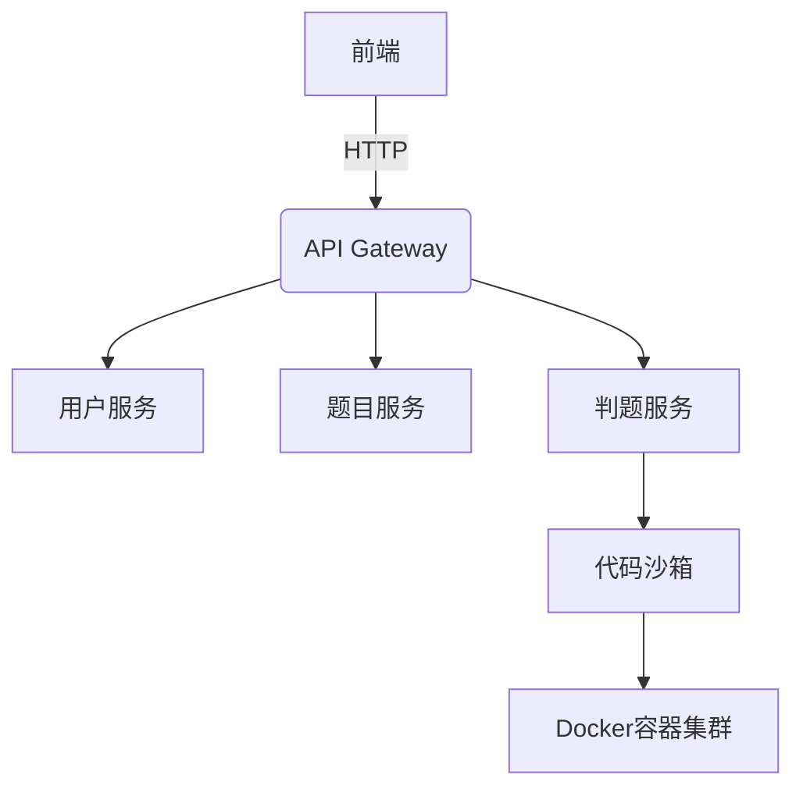

# 🚀 BusyCoding - 一站式在线代码判题平台

**作者：caoyanghalo@qq.com**

## 🚀 项目概述

基于微服务架构的在线代码评测平台，支持多种编程语言题目编写、实时代码提交、安全沙箱执行与自动化判题。

---

## 🛠️ 技术栈

### 前端
- **Vue3** + TypeScript + Vuex状态管理  
- Element Plus 组件库  
- Monaco Editor 代码编辑器

### 后端
- **Spring Boot 3** + Spring Security  
- **Spring Cloud Alibaba**  
  - Nacos 服务注册与配置中心  
  - Sentinel 流量控制  
  - OpenFeign 服务调用  
- MySQL + Redis + RabbitMQ

### 基础设施
- **Docker** 容器化部署  
- 代码沙箱隔离运行环境

---

## ✨ 核心功能

### 1. 题目搜索页面
- 关键词/标签检索  
- 分页展示题目列表  
- 题目通过率统计  

### 2. 在线做题页面
- 实时代码编辑器（语法高亮）  
- 自定义测试用例执行  
- 提交历史快速查看  

### 3. 提交列表页面
- 用户提交记录实时更新  
- 判题状态可视化（AC/WA/TLE等）  
- 代码对比与错误详情查看  

### 4. 题目管理页面
- Markdown 题目编辑器（含公式渲染）  
- 判题策略配置（时间/内存限制）  

---

## ⚙️ 系统架构

